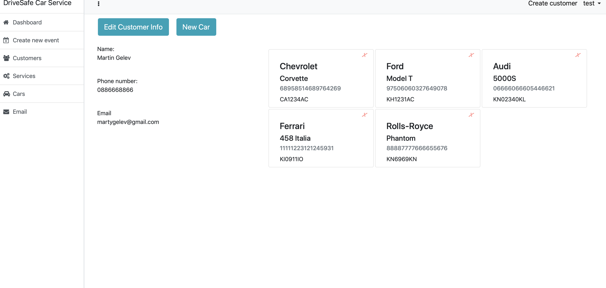

# DriveSafe-CarService

## DriveSafe - Martin Gelev, Todor Andonov (team14)
Link to our application:  
http://drivesafe-env.3wpbmmyfec.us-east-2.elasticbeanstalk.com 

DriveSafe Car Service enables the owners of car services to manage their day-to-day job. The system  have a list with all customers and their contact information (Name, telephone, email etc.). You can link specific car/cars to customer. Each specific car have some identification details (registration plate number, VIN etc.). CarServoce keep history of all services done on customer’s car/cars. The software is able to generate pdf with all performed services for a given service of the car and the total price for all done services. For all customers, а profile can be generated providing them with access to their personal information via the web UI. Profile is generated by the administrator using the system and the login information is sent to customer’s email. Generated profile is as follows: username: {customer’s email address} password: {random string value}.

## Database Diagram

## REST API documentation

## Photos

